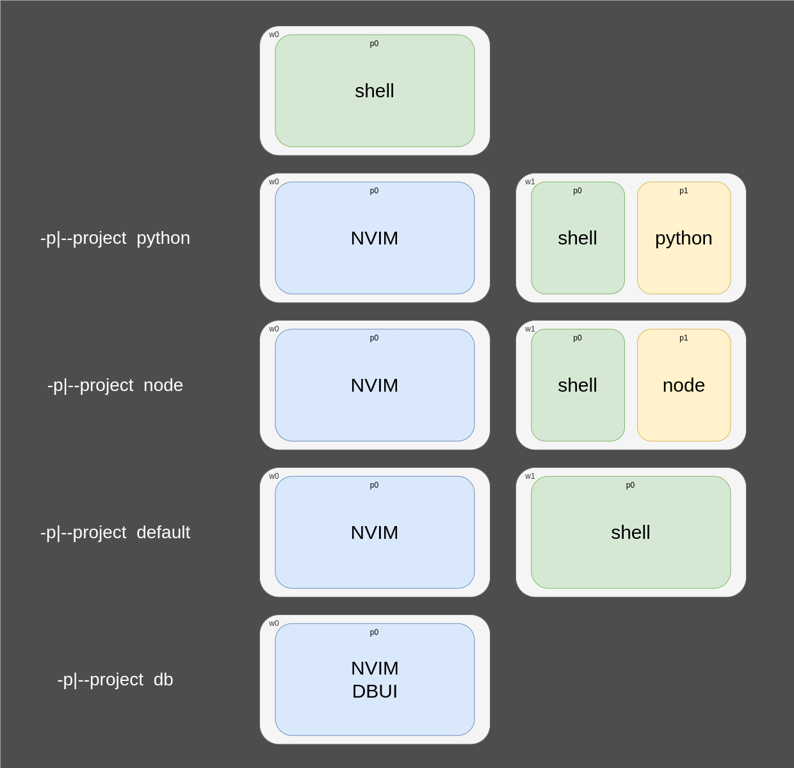

# TMUX configs and setups

## config

clone this repo in some directory, say `TMUX_CONF_DIR`

put in your `~/.tmux.conf` following:

```shell
source-file $TMUX_CONF_DIR/tmux.conf
tmux source ~/.tmux.conf
```

## session create

tldr.

```
./session.sh -s <session_name> [-d <default_dir>] [-p <project>] [-h]
```

This will create a tmux session under name `session` and will initialize all windows and panes
to use `default_dir` as cwd.

### Project specific sessions


